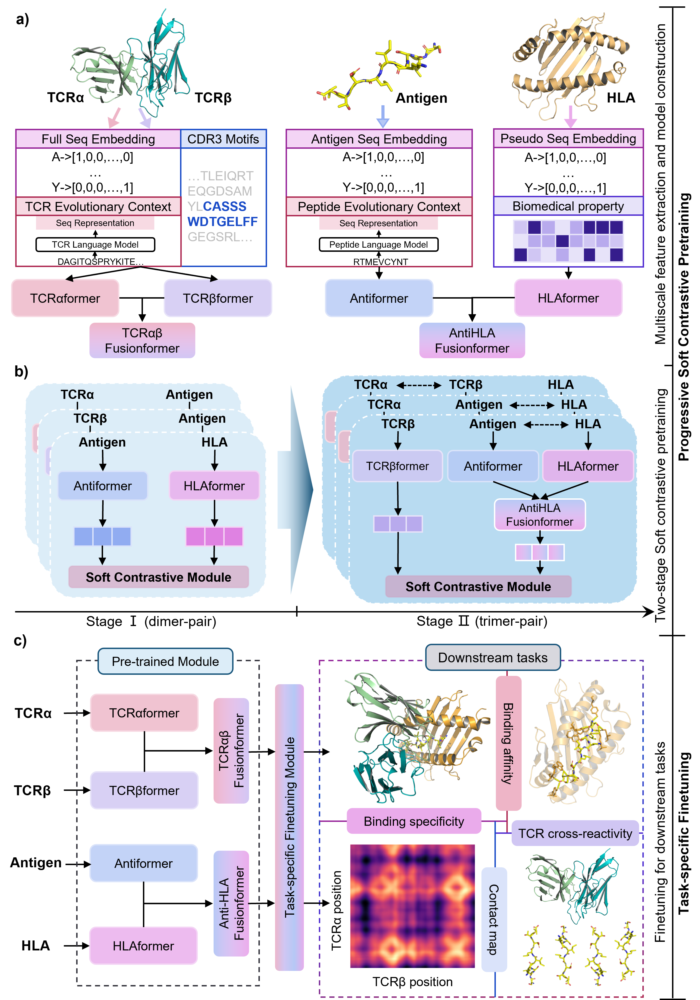

# UpTCR: A Progressive Knowledge Transfer Framework with Integrating Any Incomplete Data for TCR-Antigen-HLA Binding Recognition

This repository contains the source code for the paper: A Progressive Knowledge Transfer Framework with Integrating Any Incomplete Data for TCR-Antigen-HLA Binding Recognition.



UpTCR is a progressive knowledge transfer framework that learn priors from any incomplete data for diverse downstream tasks.

## Installation and Setup
1. **Hardware requirements**:
   This project requires only a standard computer with enough RAM and a NVIDIA GPU to support operations. We ran the demo using the following specs:
   - CPU: 10 cores, 2.5 GHz/core
   - RAM: 40GB
   - GPU: NVIDIA TESLA P40, V100, A100, A6000
   - CUDA: 11.0

2. **System requirements**:
   This tool is supported for Linux. The tool has been tested on the following system:

   - CentOS Linux release 8.2.2.2004

3. **Clone the Repository**:
   ```bash
   git clone https://github.com/TencentAILabHealthcare/PEPAF.git
   cd UpTCR
   ```

4. **Install Required Packages**:
   The basic environment requirements are:
   - Python: 3.10
   - CUDA: 11.0

   Use the following command to install the necessary packages as specified in the `requirements.txt` file:

   ```bash
   conda create -n UpTCR python==3.10
   conda activate UpTCR
   pip install -r requirements.txt
   ```

5. **Download Model Weights**:

   Download the `model_weights.zip` file and extract it to the `UpTCR/model_weights` directory. The model_weights.zip is available on Zenodo: <https://doi.org/10.5281/zenodo.15052166>

   After extraction, the `UpTCR/model_weights` directory should contain the following:

   ```plaintext
   UpTCR/model_weights/
   ├── pretrained/
   └── finetune
   ```
   The `UpTCR/model_weights/pretrained` directory contains the pretrained individual encoders and fusion encoders.

   The `UpTCR/model_weights/finetune` directory should contain the following:
    ```plaintext
   UpTCR/model_weights/finetune/
   ├── TCRABpMHC_fewshot/
   ├── TCRABpMHC_unseen/
   ├── TCRABp_fewshot/
   ├── TCRABp_unseen/
   ├── TCRBpMHC_fewshot/
   ├── TCRBpMHC_unseen/
   ├── TCRBp_fewshot/
   └── TCRBp_unseen/
   ```
   Each sub-directory contains the fine-tuned models for direct test.

6. **Download Processed Data**:

   Download the `data.zip` file and extract it to the `UpTCR` directory, specifically to `UpTCR/data`. The data.zip is available on Zenodo: <https://doi.org/10.5281/zenodo.15052166>

   After extraction, the `UpTCR/data` directory should contain the following:

   ```plaintext
   UpTCR/data/
   ├── finetune/
   ├── structure/
   └── pretrained_emb/
   ```
   The `UpTCR/data/finetune` directory contains proceseed TCR-antigen-HLA binding data for training and testing, the `UpTCR/data/structure` directory contains processed TCR-antigen-HLA structure data, and the `UpTCR/data/pretrained_emb` directory contains extracted pretrained peptide embeddings (pepesm) and tcra (tcr_a) and tcrb (tcr_b) embeddings.

   Please note that `pretrained_emb` is too large.

## Quick Start for prediction
Here we provide diverse settings for result reproduction. Please ensure the model weights (**finetune**) and data have been properly added. Because our UpTCR is able to predict for complete or modality-missing settings, the following scripts for different settings are provided.

1. **Considering all TCRa, TCRb, Antigen, HLA**
    
    Few-shot prediction:
    ```bash
    # few-shot prediction with tetrameric interaction
    python scripts/test/test_TCRABpMHC_fewshot.py
    ```
    Zero-shot prediction:
    ```bash
    # zero-shot predictin with tetrameric interaction interaction
    python scripts/test/test_TCRABpMHC_zeroshot.py
    ```
2. **Considering only TCRb, Antigen, HLA**
    
    Few-shot prediction:
    ```bash
    # few-shot prediction with only TCRb, Antigen, HLA
    python scripts/missing_test/test_TCRBpMHC_fewshot.py
    ```
    Zero-shot prediction:
    ```bash
    # zero-shot prediction with only TCRb, Antigen, HLA
    python scripts/missing_test/test_TCRBpMHC_zeroshot.py
    ```
3. **Considering only TCRa, TCRb, Antigen**
    
    Few-shot prediction:
    ```bash
    # few-shot prediction with only TCRa, TCRb, Antigen
    python scripts/missing_test/test_TCRABp_fewshot.py
    ```
    Zero-shot prediction:
    ```bash
    # zero-shot prediction with only TCRa, TCRb, Antigen
    python scripts/missing_test/test_TCRABp_zeroshot.py
    ```
4. **Considering only TCRb, Antigen**
    
    Few-shot prediction:
    ```bash
    # few-shot prediction with only TCRb, Antigen
    python scripts/missing_test/test_TCRBp_fewshot.py
    ```
    Zero-shot prediction:
    ```bash
    # zero-shot prediction with only TCRb, Antigen
    python scripts/missing_test/test_TCRBp_zeroshot.py
    ```

## Quick Start for training, validation, and testing
Here we provide diverse settings for model training, validation, and testing. Please ensure the model weights (**pretrained**) and data have been added. Our UpTCR is able to predict for complete interaction, modality-missing interaction, Antigen-HLA binding affinity prediction, and contact map prediction.

1. **Binding specificity considering all TCRa, TCRb, Antigen, HLA**
    
    Few-shot learning:
    ```bash
    # few-shot learning with tetrameric interaction
    python scripts/train/train_TCRABpMHC_fewshot.py
    ```
    Zero-shot learning:
    ```bash
    # zero-shot learning with tetrameric interaction
    python scripts/train/train_TCRABpMHC_zeroshot.py
    ```


2. **Binding specificity considering only TCRb, Antigen, HLA**
    
    Few-shot learning:
    ```bash
    # few-shot learning with only TCRb, Antigen, HLA
    python scripts/missing_train/train_TCRBpMHC_fewshot.py
    ```
    Zero-shot learning:
    ```bash
    # zero-shot learning with only TCRb, Antigen, HLA
    python scripts/missing_train/train_TCRBpMHC_zeroshot.py
    ```
3. **Binding specificity considering only TCRa, TCRb, Antigen**
    
    Few-shot learning:
    ```bash
    # few-shot learning with only TCRa, TCRb, Antigen
    python scripts/missing_train/train_TCRABp_fewshot.py
    ```
    Zero-shot learning:
    ```bash
    # zero-shot learning with only TCRa, TCRb, Antigen
    python scripts/missing_train/train_TCRABp_zeroshot.py
    ```
4. **Binding specificity considering only TCRb, Antigen**
    
    Few-shot learning:
    ```bash
    # few-shot learning with only TCRb, Antigen
    python scripts/missing_train/train_TCRBp_fewshot.py
    ```
    Zero-shot learning:
    ```bash
    # zero-shot learning with only only TCRb, Antigen
    python scripts/missing_train/train_TCRBp_zeroshot.py
    ```
5. **Learning antigen-HLA binding affinity**
    
    Run:
    ```bash
    # learning Antigen-HLA binding affinity
    python scripts/train/train_pMHC.py
    ```
6. **Learning contact maps**
    
    Run:
    ```bash
    # learning TCRa-TCRb-Antigen-HLA contact maps
    python scripts/train/train_structure.py
    ```

If you have any questions, please contact us at lvtianxu1@icloud.com.